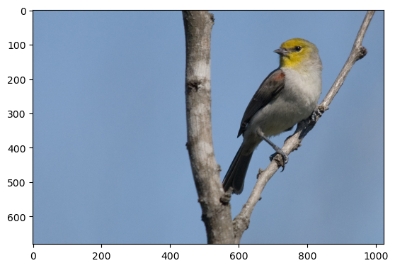
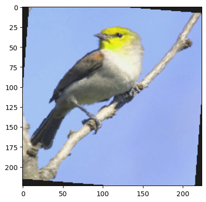
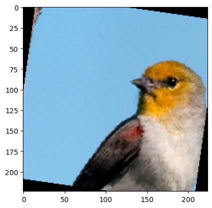
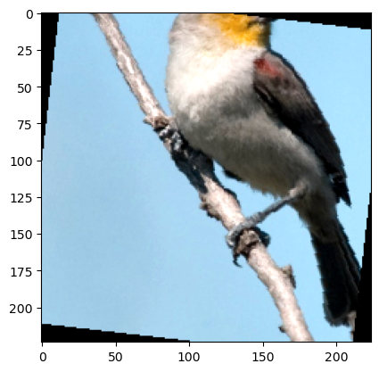
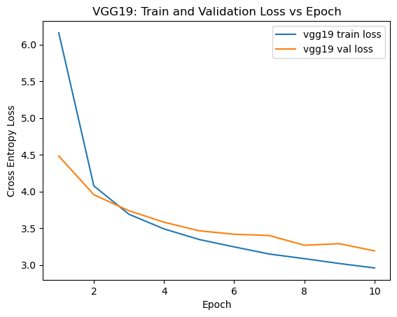
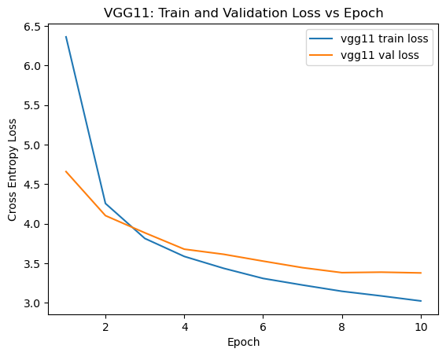

# Welcome to a the bird classifier repo!

The goal of this project is to compare the relative performance of the Vgg19 and Vgg11 CNN
architectures in a transfer learning context. The networks were originally trained on the
ImageNet dataset, and were retrained on the bird identification dataset.

All experiments were ran using the notebooks at the base of this repo, and using the various
utility functions available in the local utilities package. The local package can be loaded
using:

```
cd bird_utils
```

```
pip install -e .
```

## Datasets

All retraining in this experiment was conducted by me using the bird classification dataset. The
originall training of the VGG11 and VGG19 models used as a base for this experiment were trained
on Imagenet-1k by PyTorch contributers. The datasets are available below:

[Imag-net available here](https://www.image-net.org/)

[Bird Dataset Available Here](https://www.kaggle.com/competitions/birds23sp)

## Approach: Transfer Learning

The pre-trained Vgg19 and Vgg11 models were retrained on the bird classification dataset. Training
an entire vgg model would be way to computationally expensive. Thankfully, because of the
nature of this bird classification problem, training the entire model is not necessary.

First, some high level background on the VGG architeture. All models in the VGG family are
divided into two main compaonents, the feature extractor and the classifier:


[Image From](https://neurohive.io/wp-content/uploads/2018/11/vgg16-1-e1542731207177.png)

The feature extractor is the first "half" of the model, and is composed of a series of
convolutional and pooling layers that extract features. The second half, the classifier,
is a series of fully connected layers that take the extracted features and assign a classification
to the input. Thankfully, as the data from Imagnet-1k and the bird dataset is, at a high level,
sampled from a very similar distribution, in theory a feature extractor trained on Imagnet-1k
should be able to extract meaningfull features from samples in the bird dataset. If that
assumption holds, than it is only necessary to train the classifer, which is mych less
computational resource intensive than training the entire vgg model.

For this experiment, the VGG11 and VGG19 feature extraction layers are pre-trained by PyTorch
contributers on Imagnet-1k, and the classifier layers will be trained over 10 epochs. After
training, the results of VGG11 and VGG19 will be compared.

### Data Augmentation: More bird picture per bird picture

Unfortunately the bird dataset only contains about 60 examples per each of the 555 classes. In
order to still sucessfully train the model with the low amount of examples per class, standard
data-augmentation practices were applied during training. During each epoch, every image
was randomly transformed. This was achieved using the transform:

```
transforms.Compose([
    # Data augmentation
    transforms.RandomResizedCrop(224),
    transforms.RandomHorizontalFlip(),
    transforms.RandomRotation(10),
    transforms.ColorJitter(brightness = 0.4, contrast = 0.4, saturation = 0.4, hue = 0.1),
    transforms.ToTensor(),

    # data-standardization for imgnet dataset
    transforms.Normalize(mean = [0.485, 0.456, 0.406], std = [0.229, 0.224, 0.225]),
])
```

This effectively created more examples per class. Some examples of the
transformations are available below.

Base sample:



And with random transformations applied:







In addition to providing more examples, data-augmentation should also prevent the model from
overfitting. However, data-augmentation leads to validation errory being a pessismestic estimate
of test-error, which was observed empiracally while training both models.

## Setup

Both the VGG 11 and VGG 13 models were trained for 10 epochs using the same non-model
architecture hyperparamters. These are available in the table below:

| Hyperparamter | Value |
| ------------- | ----- |
| Optimizer     | SGD   |
| Batch Size    | 64    |
| Learn Rate    | 0.001 |
| Momentum      | 0.9   |

Before training, the enire bird dataset was divided into train and validaition sets with
a 90-10 split. The split was preseeded so that it remained consistant across trials. During
training, the validation set was augmented in addition to the training set. However, during
the validaition stage the train set was not augmented, only resized. This was executed using
the transformation below:

```
transforms.Compose([
    # Data augmentation
    transforms.Resize(size = 224),
    transforms.CenterCrop(size = 224),
    transforms.ToTensor(),

    # data-standardization for imgnet dataset
    transforms.Normalize(mean = [0.485, 0.456, 0.406], std = [0.229, 0.224, 0.225]),
])
```

## Results

The training curves are available below:





From the graphs, it is clear that transfer learning VGG19 and VGG11 perform very similarely. This
is even more clear when the trained VGG19 and VGG11 networks were tested against the unaugmented
dataset. On the unaugmented dataset, VGG11 and VGG19 achieved an accuracy of 49% and 51%
respectively.
